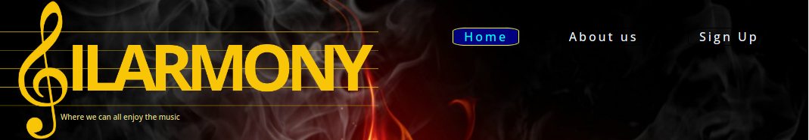
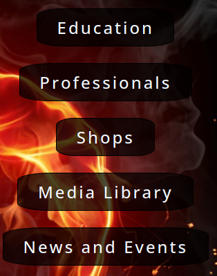
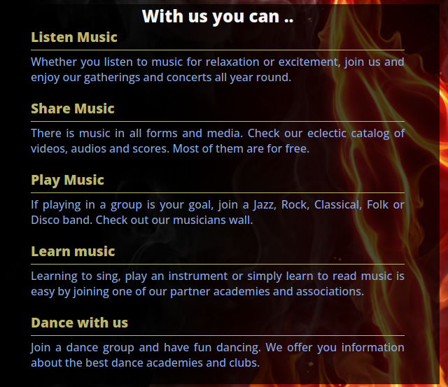
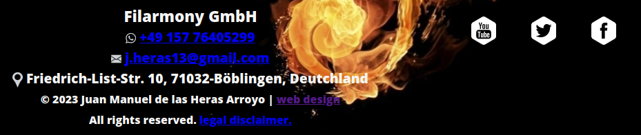
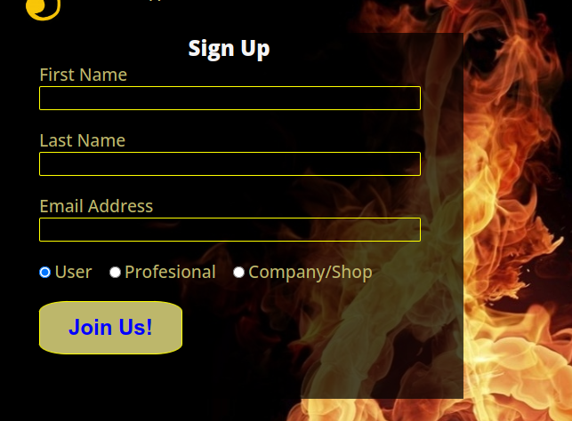

# FILARMONY

This site aims to be a hub for all kinds of music lovers, acting as a connecting thread between musicians, music lovers, singers, dancers, composers and their corresponding companies.

This website should be self-financed by links to sponsors who receive visits from users who may be interested in their products.
Music or dance schools, instrument shops, music download services and other related businesses can enhance their internet presence by displaying links to their own web pages on this website, without appearing as commercial advertisements. 

The idea is that as this website increases its content, it will also increase its attractiveness to consumers, who will be able to satisfy all their musical needs from one centralised site.

## Features 
This project defines a static website that serves as a hub for users to find music-related content in a structured way.
The ultimate goal is to get sponsors to provide links to the content, so that the user can consume their products without being bombarded by intrusive advertisements.
At the moment there are 3 functional pages implemented:
* The 'Home' page :  
  - Displays generic information about the service to attract the user.  
  - A Navigation Bar (Main Menu) 
  - A menu to access the contents
  - A footer with contact information.
* The 'About Us' page:  
    - Displays basic information about the company
* The 'Sign Up" page:
   - Allows a user to register with the server for future visits.
 

### Existing Features

- __Navigation Bar__

  - Featured on all three pages, the full responsive navigation bar includes links to the Logo, Home page, About Us  and Sign Up page, and is identical in each page to allow for easy navigation.
  - This section will allow the user to easily navigate from page to page across all devices without having to revert back to the previous page via the ‘back’ button. 

- __The Content menu__

  - The content menú provides a way for the user to access to a related content page dynamically created acording to the user type.
  

- __With Us_section__

  - This section will allow the user to see what can be obtain from this site. 

- __The Footer__ 

    - The footer section includes:
      * links to the relevant social media sites for Filarmony. The links will open to a new tab to allow easy navigation for the user. 
      * Name, phone number and email information for the company
      * Web site developert contact information and 
      * Legal disclamer
  - The footer is valuable to the user as it encourages them to keep connected via social media

- __About Us Page__

  - This page will provide the user with information over Filarmony company.
  - This section is valuable to the user to identify the type of company and people behind the service. 

- __The Sign Up Page__

  - This page will allow the user to get signed up to Filarmony to start gaining access to all the content. The user will be able specify the type of user to be used for the dynamic creation of the content pages. 
  - The user will be asked to submit their full name and email address. 

### Features Left to Implement

- All the content pages would be implemented in the future with dynamic content.
- Since this is an international web page, it sould be inmplemented in additional languages (Spanish, German, French, etc..)

## Testing 

In this section, you need to convince the assessor that you have conducted enough testing to legitimately believe that the site works well. Essentially, in this part you will want to go over all of your project’s features and ensure that they all work as intended, with the project providing an easy and straightforward way for the users to achieve their goals.

In addition, you should mention in this section how your project looks and works on different browsers and screen sizes.

You should also mention in this section any interesting bugs or problems you discovered during your testing, even if you haven't addressed them yet.

If this section grows too long, you may want to split it off into a separate file and link to it from here.

### Validator Testing 

- HTML
  - No errors were returned when passing through the official [W3C validator](https://validator.w3.org/nu/?doc=https%3A%2F%2Fcode-institute-org.github.io%2Flove-running-2.0%2Findex.html)
- CSS
  - No errors were found when passing through the official [(Jigsaw) validator](https://jigsaw.w3.org/css-validator/validator?uri=https%3A%2F%2Fvalidator.w3.org%2Fnu%2F%3Fdoc%3Dhttps%253A%252F%252Fcode-institute-org.github.io%252Flove-running-2.0%252Findex.html&profile=css3svg&usermedium=all&warning=1&vextwarning=&lang=en#css)

### Unfixed Bugs

You will need to mention unfixed bugs and why they were not fixed. This section should include shortcomings of the frameworks or technologies used. Although time can be a big variable to consider, paucity of time and difficulty understanding implementation is not a valid reason to leave bugs unfixed. 

## Deployment

This section should describe the process you went through to deploy the project to a hosting platform (e.g. GitHub) 

- The site was deployed to GitHub pages. The steps to deploy are as follows: 
  - In the GitHub repository, navigate to the Settings tab 
  - From the source section drop-down menu, select the Master Branch
  - Once the master branch has been selected, the page will be automatically refreshed with a detailed ribbon display to indicate the successful deployment. 

The live link can be found here - https://code-institute-org.github.io/love-running-2.0/index.html 

## Credits 

In this section you need to reference where you got your content, media and extra help from. It is common practice to use code from other repositories and tutorials, however, it is important to be very specific about these sources to avoid plagiarism. 

You can break the credits section up into Content and Media, depending on what you have included in your project. 

### Content 

- The text for the Home page was taken from Wikipedia Article A
- Instructions on how to implement form validation on the Sign Up page was taken from [Specific YouTube Tutorial](https://www.youtube.com/)
- The icons in the footer were taken from [Font Awesome](https://fontawesome.com/)

### Media

- The photos used on the home and sign up page are from This Open Source site
- The images used for the gallery page were taken from this other open source site

Congratulations on completing your Readme, you have made another big stride in the direction of being a developer! 

## Other General Project Advice

Below you will find a couple of extra tips that may be helpful when completing your project. Remember that each of these projects will become part of your final portfolio so it’s important to allow enough time to showcase your best work! 

- One of the most basic elements of keeping a healthy commit history is with the commit message. When getting started with your project, read through [this article](https://chris.beams.io/posts/git-commit/) by Chris Beams on How to Write  a Git Commit Message 
  - Make sure to keep the messages in the imperative mood 

- When naming the files in your project directory, make sure to consider meaningful naming of files, point to specific names and sections of content.
  - For example, instead of naming an image used ‘image1.png’ consider naming it ‘landing_page_img.png’. This will ensure that there are clear file paths kept. 

- Do some extra research on good and bad coding practices, there are a handful of useful articles to read, consider reviewing the following list when getting started:
  - [Writing Your Best Code](https://learn.shayhowe.com/html-css/writing-your-best-code/)
  - [HTML & CSS Coding Best Practices](https://medium.com/@inceptiondj.info/html-css-coding-best-practice-fadb9870a00f)
  - [Google HTML/CSS Style Guide](https://google.github.io/styleguide/htmlcssguide.html#General)

Getting started with your Portfolio Projects can be daunting, planning your project can make it a lot easier to tackle, take small steps to reach the final outcome and enjoy the process! 