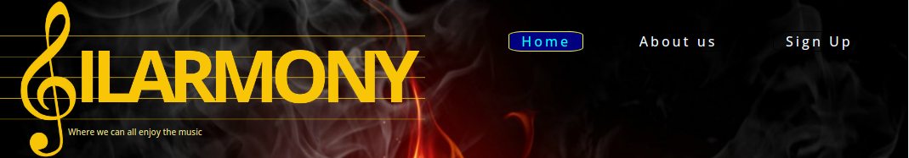
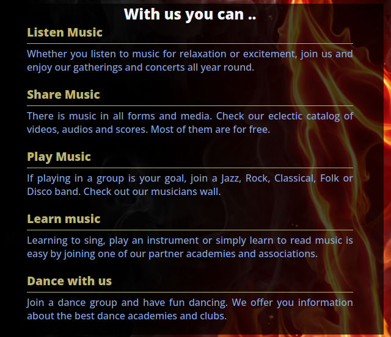
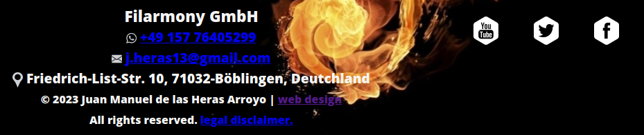
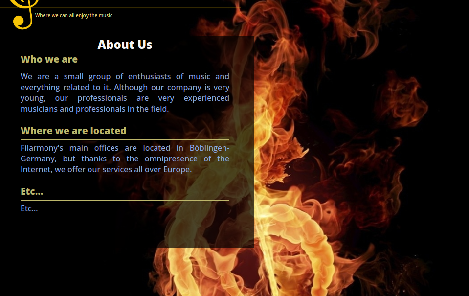
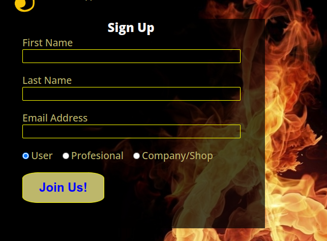

# FILARMONY

This site aims to be a hub for all kinds of music lovers, acting as a connecting thread between musicians, music lovers, singers, dancers, composers and their corresponding companies.

This website should be self-financed by links to sponsors whom receive visits from users who may be interested in their products.
Music or dance schools, instrument shops, music download services and other related businesses can enhance their internet presence by displaying links to their own web pages on this website, without appearing as commercial advertisements. 

The idea is that as this website increases its content, it will also increase its attractiveness to consumers, whom will be able to satisfy all their musical needs from one centralised site.

## Features 
This project defines a static website that serves as a hub for users to find music-related content in a structured way.
The ultimate goal is to get sponsors to provide links to the content, so that the user can consume their products without being bombarded by intrusive advertisements.
At the moment there are 3 functional pages implemented:

- The 'Home' page :  
    * Displays generic information about the service to attract the user.  
    * Contains a Navigation Bar (Main Menu).
    * Contains a menu to access the contents (Content Menu).
    * Contains a footer with contact information.

- The 'About Us' page:  
    * Displays basic information about the company
    * Contains a Navigation Bar (Main Menu).
    * Contains a footer with contact information.

- The 'Sign Up" page:
    * Allows a user to register with the server for future visits.
    * Contains a Navigation Bar (Main Menu).
    * Contains a footer with contact information.

### Existing Features

- __Navigation Bar__

  - Featured on all three pages, the full responsive navigation bar includes links to the Logo, Home page, About Us  and Sign Up page, and is identical in each page to allow for easy navigation.
  - This section will allow the user to easily navigate from page to page across all devices without having to revert back to the previous page via the ‘back’ button. 

- __The Content menu__

  - The content menú provides a way for the user to access to a related content page dynamically created acording to the user type.
  

- __With Us_section__

  - This section will allow the user to see what can be obtain from this site. 

- __The Footer__ 

    - The footer section includes:
      * links to the relevant social media sites for Filarmony. The links will open to a new tab to allow easy navigation for the user. 
      * Name, phone number and email information for the company
      * Web site developert contact information and 
      * Legal disclamer
  - The footer is valuable to the user as it encourages them to keep connected via social media

- __About Us Page__

  - This page will provide the user with information over Filarmony company.
  - This section is valuable to the user to identify the type of company and people behind the service. 

- __The Sign Up Page__

  - This page will allow the user to get signed up to Filarmony to start gaining access to all the content. The user will be able specify the type of user to be used for the dynamic creation of the content pages. 
  - The user will be asked to submit their full name and email address. 

### Features Left to Implement

- All the content pages would be implemented in the future with dynamic content.
- Since this is an international web page, it sould be inmplemented in additional languages (Spanish, German, French, etc..)

## Testing 

### Validator Testing 

- HTML
  - No errors were returned when passing through the official [W3C validator](https://validator.w3.org/nu/?doc=https://juanma1313.github.io/filarmony/index.html)
- CSS
  - No errors were found when passing through the official [(Jigsaw) validator](https://jigsaw.w3.org/css-validator/validator?uri=https://juanma1313.github.io/filarmony/index.html&profile=css3svg&usermedium=all&warning=1&vextwarning=&lang=en#css)

### Unfixed Bugs

- When using screens smaller that 1024px
  * The navigation-menus are not correctly centered.
  * The social-network icons are not possition as desired.

## Deployment

- The site was deployed to GitHub pages. The steps to deploy are as follows: 
  - In the GitHub repository, navigate to the Settings tab 
  - From the source section drop-down menu, select the Master Branch
  - Once the master branch has been selected, the page will be automatically refreshed with a detailed ribbon display to indicate the successful deployment. 

The live link can be found here - https://juanma1313.github.io/filarmony/index.html

## Credits 

### Content 

- Implement form validation on the Sign Up page was reused from the Love running project
- The icons in the footer were taken, with consent, from https://www.divertimusica.com

### Media
- Following background images where obtained from todofondos.com
  * assets/images/treble-clef-in-flames.jpg
  * assets/images/note-in-flames.jpg
- assets/images/filarmony-logo.jpg is my own.
- Favicon.png - Downloaded from PNGEgg [png-wglrc-icon](https://www.pngegg.com/en/png-wglrc)

# Customer assessment
The following link leads to the document specifying the client's requirements not met in the first delivery of the project. It also shows the actions taken to remedy them and their current state of development.

[Initial submition customer review ](doc/customer-review.md)
